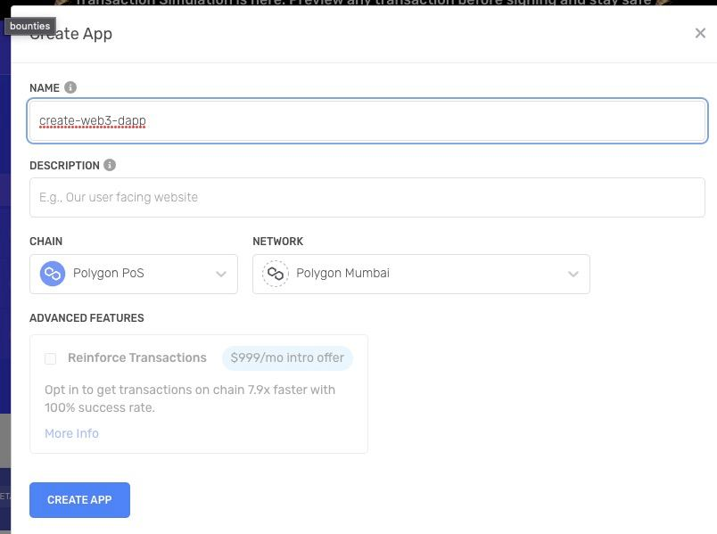
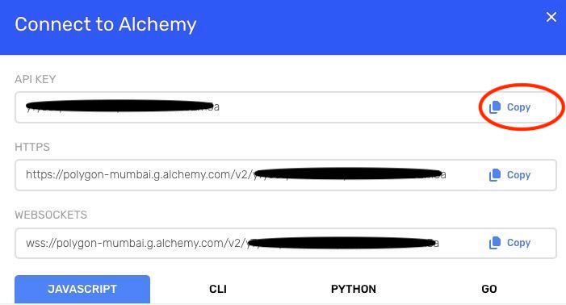
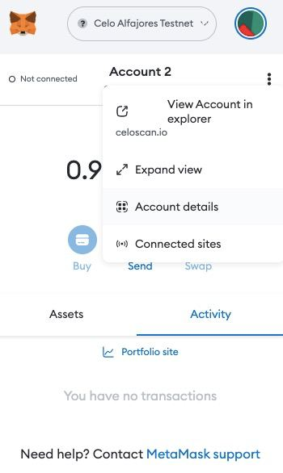

# Leipzig DAO Web3 Dev Tooling workshop

Workshop happening on the 05.04.2023 at 7pm in Basislager Leipzig.

[Slides to Presentation](https://www.canva.com/design/DAFfOXP4_jU/y2F5b-R-80iKMtXVY_K1Tg/watch?utm_content=DAFfOXP4_jU&utm_campaign=designshare&utm_medium=link&utm_source=publishsharelink)

Goal of this workshop is to understand how to build a simple web3 app with BE and FE and how to connect both.

We will be using the [Create web3 dapp](https://docs.alchemy.com/docs/create-web3-dapp-quickstart) project set up form [Alchemy](https://www.alchemy.com/?a=baab12f2fd)

To see the complete setup, check out the branch `finished`

## Setting up the project

First let's go to [Alchemy](https://www.alchemy.com) and create an Account.

Then in Alchemy, we will create our first project. Enter the name, choose `Polygon PoS` as the Chain and `Polygon Mumbai` as the Network.



In your terminal, navigate to the folder you want to create your project in and run:

```
npx create-web3-dapp@latest
```

You can make the following selections:

- Choose how to start: "create default full-stack dapp"
- Choose your chain: "Polygon"
- Choose your blockchain development environment: "[Hardhat](https://hardhat.org)", I advise you to check out [Truffle](https://trufflesuite.com) as they have great tooling for local development. In this case we choose Hardhat as it is a bit lighter as a framework.
- Do you want to create a smart contract?: "yes"
- What kind of smart contract do you want to create?: "ERC20"
- Name for your Contract: "GigaHierz"
- Symbol for your contract: "GIG"
- Smart contract features to implement: Enter
- Are you done selecting contract features?: yes


- Do you already have an Alchemy account?: yes
- Insert your Alchemy API Key: "your key"

You will then have to enter your [Alchemy](https://www.alchemy.com) API Key you will get form your project.



Congratulations, you've created your first project. So let's get it running!!!!

## Compile your smart contract

We have already selected a smart contract as a template, but if you want to write your own ones, and are new to Solidity, you can check out [Cryptozombies](https://cryptozombies.io) for self-studying. And [Encode Club](https://www.encode.club/encode-bootcamps) for an intensive Solidity intro course.

If you want to find other templates, check out Open Zeppelin [Contracts Wizard](https://wizard.openzeppelin.com).

But okay. Let's get started with our project.

1. First you want to fill in all keys into the `.env`file.
   1.1. Your 'ALCHEMY_API_KEY' should already be filled in.
   1.2. Don't worry about the 'ETHERSCAN_API_KEY' right now, we won't need it. But if you want to get it , just sign up at [Etherscan](https://etherscan.io) there and find it under your "API Keys".
   1.3. Add your private key. You can find that by going to your MetaMask wallet and checking for "account details" and then choosing "Export Private Key". Please always use a separate Wallet for development to keep your funds safe!!!!



2. Let's compile that contract!!

2.1. Fund our wallet to compile the contract

Got to Alchemy Mumbai [Faucet](https://mumbaifaucet.com) to get Matic test-tokens.

2.2. Compile the contract

In your terminal, navigate into the `./backend` folder,

```
cd my-create-web3-dapp/backend
```

in my case the `hardhat.config.js` file had a mistake and I hat to move all data except the `version` property from the `solidity` property to a the same level as the `solidity` property.

and run

```
npx hardhat run ./scripts/MyContract_deploy.js --network MATIC_MUMBAI
```

Great now in your terminal you can see the address of your deployed contract. You can now check it on [Etherscan](https://etherscan.io).

## Call the smart contract in the FrontEnd

To interact with the Blockchain through the frontend, we are using the RPC point provided by Alchemy and [Wagmi](https://wagmi.sh/), a collection of React Hooks containing everything you need to start working with Ethereum.

### Import contract

So first of all, we want to call a function form our smart contract. The mint function. For that we will use the [`useContractWrite()`](https://wagmi.sh/react/hooks/useContractWrite) function from Wagmi.

In our `index.js` file, we will add the following code to call out mint function. What we are doing here, is to first get the contractAddress, and the compiled version as well as the funciton that we want to call. then we use the `useContractWrite()` hook, where `data` will be our return data frmo the function call, `isLoading` the current status of our fucntion call and `write` the function call.

```
  const { config } = usePrepareContractWrite({
    address: '0xE594d9Ac924a458313e5a8B9B59fdcbdd1F5B53C',
    abi: myContract.abi,
    functionName: 'mint'
  })

    const { data, isLoading, isSuccess, write } = useContractWrite(config)

```

Now we need to import the `abi` of our contract. So we will create a new folder in our `frontend` folder called `abis` and copy the `MyContract.json` file from the `backend/artifacts` folder. Then we want to import it into our `index.jsx` file.

```
import myContract from '../abis/MyContract.json'
```

### Call function

now we want to call that function, so lets add a button to our frontend. So let's remove all content and just add the button.

Our return value should look like this

```
  return (
    <div>
      <main className={styles.main}>
        <button disabled={!write} onClick={() => write?.()}>
          Mint
        </button>
      </main>
    </div>
  )
```

When we now click the button, we will get an error, as we still need to input arguments to our function call, as the `mint()` function takes two arguments:

- `to` - a wallet address, we want to mint the tokens too.
- `amount` - amount of token, that we want to mint

Let's mint this into our wallet, and let's do 1000 tokens.

1. get our wallet address with [`useAccount()`](https://wagmi.sh/react/hooks/useAccount) from Wagmi.

first import the hook

```
import { useAccount } from 'wagmi'
```

and add the hook to our code

```
  const { address, isConnecting, isDisconnected } = useAccount()
```

now we want to add the input to our function call like this

```
 const { config } = usePrepareContractWrite({
    address: '0xecb504d39723b0be0e3a9aa33d646642d1051ee1',
    abi: myContract.abi,
    functionName: 'mint',
    args: [address, 10000]
  })

```

And we also want to see our current state of the function call so let's add that also to our frontend.

```
<p>{isLoading && <div>Check Wallet</div>}</p>
<p> {isSuccess && <div>Transaction: {JSON.stringify(data)}</div>}</p>

```

Our code should look like this now:

```
import styles from '../styles/Home.module.css'
import InstructionsComponent from '../components/InstructionsComponent'
import { useContractWrite, usePrepareContractWrite, useAccount } from 'wagmi'
import myContract from '../abis/MyContract.json'

export default function Home () {
  const { address, isConnecting, isDisconnected } = useAccount()

  const { config } = usePrepareContractWrite({
    address: '0xecb504d39723b0be0e3a9aa33d646642d1051ee1',
    abi: myContract.abi,
    functionName: 'mint',
    args: [address, 10000]
  })

  const { data, isLoading, isSuccess, write } = useContractWrite(config)

  return (
    <div>
      <main className={styles.main}>
        <button disabled={!write} onClick={() => write?.()}>
          Mint
        </button>
        <p>{isLoading && <div>Check Wallet</div>}</p>
        <p> {isSuccess && <div>Transaction: {JSON.stringify(data)}</div>}</p>
      </main>
    </div>
  )
}

```

Now we just wan to add some styling to our text:
